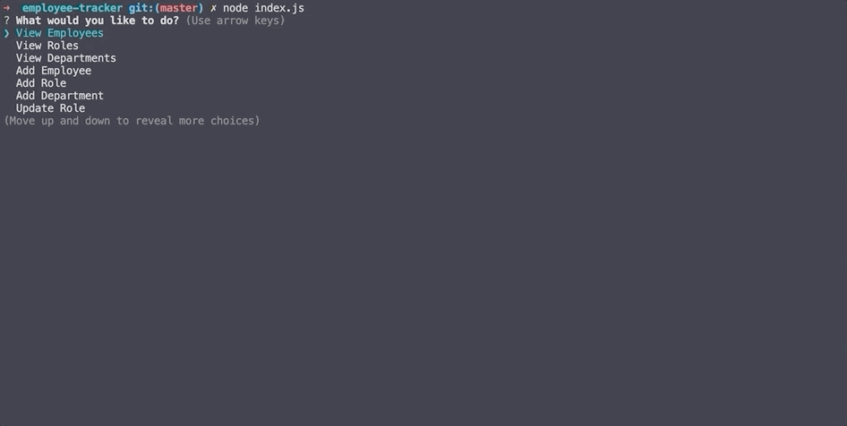
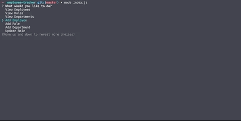
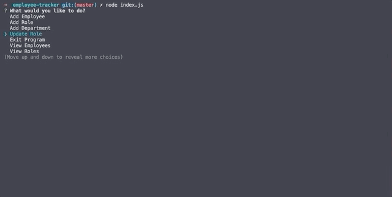
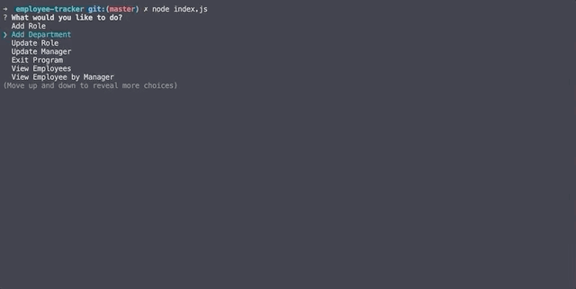
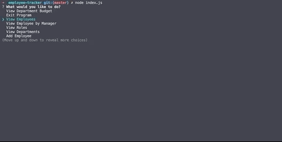

# Employee Tracker

## Description

A command-line solution to managaging employees by connecting various tables in an employee database.

## Getting Started

Note: If you do not want to follow the steps listed below to run the application, simply see the project in action by looking at the GIFs further below.  

To run this application:  

1. Clone a copy of the repository and download to your device 
2. Run an 'npm install' from your terminal to install the necessary npm packages.  
3. If you do not have Node.JS installed on your machine you will need to install that as well, see documentation [here](https://nodejs.org/en/download/). Otherwise proceed to next step.  
4. Run 'node index.js' from your terminal and the application will begin.

## GIFs illustrating functionality

View employees:

View roles:

View departments:

Add a new department:

Add a new role:

Add a new employee:

Update role:

Exit Program:

Bonus - Update employee manager:

Bonus - View employees by manager:

Bonus - Delete department:

Bonus - Delete role:

Bonus - Delete employee:

Bonus - View sum of salaries by departments:

## Built With:

JavaScript - programming language  
Bootstrap - CSS Framework  
Node.js - JavaScript runtime  
Inquirer - npm package for command line prompts  
console.table - npm package to render tables in terminal  
mysql - npm package for database manipulation  

## Author:

Brittany Fortner  
Refactor assistance provided by Tucker Beauchamp  
See commit history [here](https://github.com/bfeliz/employee-tracker/graphs/contributors).

## Planned Updates

There are no plans to further update this application at this time.
