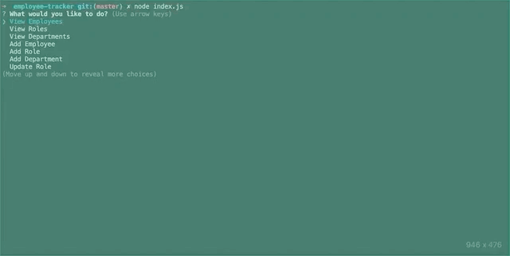
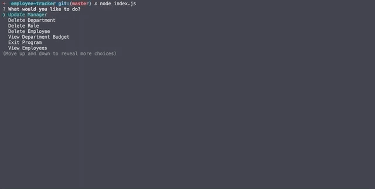
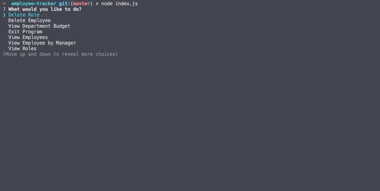

# Employee Tracker

## Description

A command-line solution to managaging employees by connecting various tables in an employee database.

## GIFs illustrating functionality

View employees:

View roles:

View departments:

Add a new department:

Add a new role:

Add a new employee:

Update role:

Exit Program:

Bonus - Update employee manager:

Bonus - View employees by manager:

Bonus - Delete department:

Bonus - Delete role:

Bonus - Delete employee:

Bonus - View sum of salaries by departments:

## Link to GitHub repository:

https://github.com/bfeliz/employee-tracker

## Author:

Brittany Fortner
